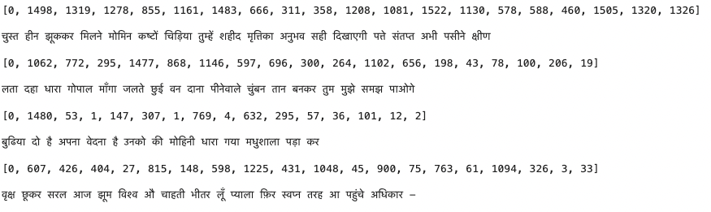

# Hindi-Seq2Seq-Model---Generating-Hindi-Poems-using-RNN

This project part of the Neural Modeling course (INFO6106) i took at Northeastern University under Prof Dino konstantopoulos in Fall'23. We train a Sequence Model on a corpus of Hindi Poems to generate new sentences. We leverage basic principles of NLP, text processing and Sequence Modeling.

## Objective
Our goal is to create a sequence model, using numpy implementation of RNN (Recurrent neural networks) to be able to predict the next word in a particular given language (here it is Hindi). We leverage indic-nlp library for tokenizing purposes, which is developed by AI4Bharat (a venture by IIT Madras) the documentation can be found here. AI4Bharat has also fine tuned fasttext for Hindi and made public access to the model and embeddings which we leverage going forward for modeling.

 ## Training data - Harivansh Rai Bachchan's poems
 
We are leveraging poems by [Shree Harivansh Rai Bachchan](https://en.wikipedia.org/wiki/Harivansh_Rai_Bachchan) who is a well known Indian poet, his work in Hindi present a rich tapestry of emotion and meaning. Using the power of neural networks and natural language processing (NLP) let's craft a unique and interactive experience – a Hindi poetry chatbot inspired by the timeless verses of Harivansh Rai Bachchan. We are using 32 of his best poems as the dataset.

## Predictions

Below, are some of text sentences generated by the Model after being trained.

 
Hindi Sentences Generated by the Sequence Model

